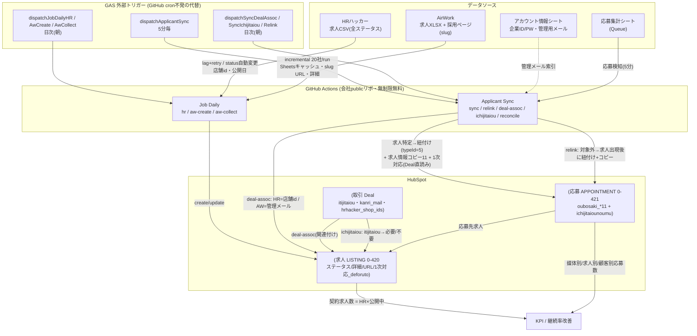
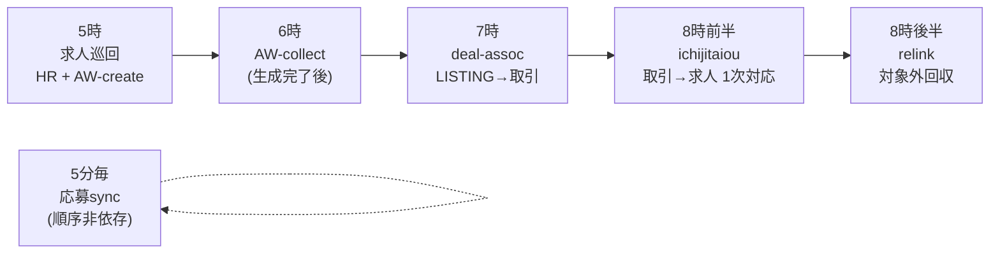

# システムアーキテクチャ — 求人/応募 媒体CSV同期 (WBS 1.11.9)

2026-07-09 時点。GitHub は下記 Mermaid を自動レンダリングする(オンライン閲覧可)。
mermaid.live に貼り付けても見られる。

## 全体フロー



## 実行順序 (日次バッチ, 9時定時前に完了)



## 主要な設計判断

| 論点 | 採用した設計 |
|---|---|
| スケジューラ | GitHub cron不発(新規アカ×短間隔)→ **GAS外部トリガー** |
| 順序依存 | **順序非依存**(relink回収 + 1次対応はDeal直読み) |
| AW全社一斉 | **廃止 → incremental 20社/runローテーション + 応募起点オンデマンド** |
| Sheets 429 | account_loader **プロセス内キャッシュ**(1回読み) |
| 求人ステータス | CSV全ステータス取込 + **自動変更**(非公開→公開終了) |
| 求人↔取引 | HR=店舗id→hrhacker_shop_ids / AW=管理メール→kanri_mail_address |
| 応募↔求人 | 媒体求人ID単位・タイトル名寄せ禁止・関連typeId=5 |
| BAN対策 | セッション再利用・12社/run上限・incremental |
```
